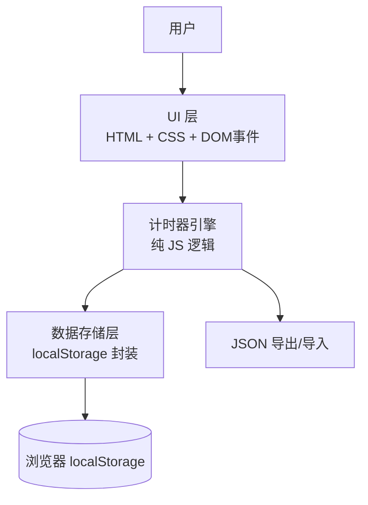

# 技术设计：工作计时器与人天统计应用

---
topic: 工作计时器与人天统计应用
date: 2026-04-21
mode: 轻量
design_doc: docs/plans/2026-04-21-00-00/time-tracker-design.md
---

## 1. 架构概览

### 1.1 分层与组件职责

本应用为纯前端单页应用，采用**三层架构**：

| 层级 | 职责 | 对应代码 |
|------|------|----------|
| **UI 层** | 渲染界面、响应用户交互（点击、输入、拖拽） | HTML 结构 + CSS 样式 + DOM 事件监听 |
| **计时器引擎** | 计时逻辑、时间计算、休息扣除、人天换算 | JavaScript 核心函数 |
| **数据存储层** | localStorage 读写、数据序列化/反序列化、JSON 导出/导入 | Storage API 封装函数 |

**职责边界**：
- UI 层只负责展示和收集用户输入，不直接操作 localStorage
- 计时器引擎是纯逻辑层，不依赖 DOM，可独立测试
- 数据存储层只负责持久化，不包含业务逻辑

### 1.2 组件通信方式

三层之间通过**同步函数调用**通信：

```
用户点击 → UI 层事件处理 → 调用计时器引擎 → 调用数据存储层保存 → UI 层更新显示
```

没有异步请求、没有事件总线、没有状态管理库——因为应用足够简单，直接函数调用最清晰。

### 1.3 关键数据流

**开始计时 → 停止计时 → 保存记录 → 更新统计**：

1. 用户点击"开始"按钮 → UI 层记录 `startTime = Date.now()`，启动 `setInterval` 更新显示
2. 用户点击"停止"按钮 → UI 层计算 `endTime = Date.now()`
3. 调用计时器引擎：`createTimeEntry(taskName, startTime, endTime)`
4. 计时器引擎计算原始时长，扣除重叠的休息时段，生成 `TimeEntry` 对象
5. 调用数据存储层：`saveEntry(entry)` → 写入 localStorage
6. UI 层重新渲染今日记录列表和统计面板

### 1.4 组件图



---

## 2. 技术决策和选型（ADR）

### ADR-001: 不使用前端框架，采用原生 Vanilla JS

- **状态**: 已决定
- **上下文**: 应用功能简单（计时器、localStorage 读写、时间计算），用户要求极简、零配置、双击即用
- **选项**:
  - A: React/Vue + 构建工具 — 生态丰富，但需要 npm、打包、编译，产出多文件
  - B: 原生 Vanilla JS — 零依赖、零构建、单文件运行、浏览器原生支持
- **决定**: 选择 **B**，因为功能复杂度远低于框架的价值拐点，原生 JS 完全足够
- **后果**:
  - 无构建步骤，开发即保存即刷新
  - 单文件即可交付，用户双击打开
  - 需要自己管理 DOM 更新（但界面简单，不复杂）
  - 测试采用浏览器手动验证 + 可选的简单 JS 单元测试

### ADR-002: 单 HTML 文件内嵌 CSS 和 JS

- **状态**: 已决定
- **上下文**: 用户要求极简，追求"拿到就能用"的体验
- **选项**:
  - A: 三文件分离（index.html + style.css + app.js）— 结构清晰，但用户需要管理多个文件
  - B: 单 HTML 文件（`<style>` + `<script>` 内嵌）— 一个文件搞定一切
- **决定**: 选择 **B**，在 `<head>` 中内嵌 CSS，在 `<body>` 末尾内嵌 JS
- **后果**:
  - 交付物只有一个 `.html` 文件
  - 代码组织上通过注释分隔 CSS/JS/HTML 区域
  - 如需拆分，后期可轻松提取为外部文件（无框架绑定）

### ADR-003: 不使用 CSS 框架

- **状态**: 已决定
- **上下文**: 界面简单（按钮、列表、几个统计数字），用户要求简洁实用风格
- **选项**:
  - A: Tailwind / Bootstrap — 样式丰富，但引入外部依赖或增加体积
  - B: 原生 CSS — 几十行即可满足需求，零依赖
- **决定**: 选择 **B**，手写原生 CSS，控制精确且体积最小
- **后果**:
  - 样式代码量少（预计 < 200 行 CSS）
  - 无外部网络请求（即使离线也能正常显示）

---

## 3. 编码约定

### 3.1 命名规范

- **变量/函数**：camelCase，语义化（如 `startTimer`, `calculateEffectiveTime`）
- **常量**：UPPER_SNAKE_CASE（如 `HOURS_PER_DAY = 8`）
- **DOM 元素 ID**：kebab-case（如 `timer-display`, `task-list`）
- **CSS 类名**：kebab-case，BEM 风格（如 `.task-item`, `.btn-primary`）

### 3.2 错误处理

- localStorage 读写失败时：使用 `try/catch`，失败时在控制台输出错误并在 UI 显示"存储失败，请检查浏览器权限"
- 时间计算异常（如结束时间 < 开始时间）：返回 0 并在 UI 提示
- JSON 导入格式错误：捕获异常，显示"文件格式不正确"

### 3.3 测试策略

- **手动测试为主**：由于应用是单文件 HTML，直接在浏览器打开验证功能
- **验收测试清单**：
  1. 开始/停止计时正常
  2. 刷新页面后计时状态恢复
  3. 休息时段扣除正确
  4. 人天换算正确
  5. 导出/导入数据完整
  6. 历史记录可编辑

### 3.4 质量门禁

- 无 lint/typecheck 要求（无构建工具）
- 代码通过浏览器开发者工具 Console 无报错
- 在 Chrome / Edge / Firefox 最新版验证通过

---

## 4. 风险与缓解（技术层面）

### R1: localStorage 容量不足或禁用
- **影响**：数据无法保存或存储空间耗尽
- **缓解**：
  - 估算：每条记录约 200 字节，5MB 可存约 25000 条记录（足够数年使用）
  - 在应用启动时检测 localStorage 可用性，禁用时提示用户
  - 提供导出按钮，鼓励用户定期备份

### R2: 页面刷新导致计时中断
- **影响**：用户刷新页面后，正在进行的计时丢失
- **缓解**：
  - 计时开始时将 `startTime` 和 `currentTask` 写入 localStorage
  - 页面加载时检测是否存在未完成的计时，自动恢复
  - 使用 `beforeunload` 事件做最后的保存兜底

### R3: 跨天计时导致日期归属混乱
- **影响**：用户在 23:59 开始计时，00:30 停止，记录归属不明确
- **缓解**：
  - 规则：记录归属到**开始日期**
  - 次日打开应用时检测未停止的计时，提示用户确认实际停止时间
  - 默认将跨天记录截断到当天 23:59，剩余部分归入次日（用户可手动调整）

### R4: 单文件代码膨胀导致可维护性下降
- **影响**：随着功能增加，HTML 文件越来越长，难以维护
- **缓解**：
  - 通过注释明确分隔 HTML/CSS/JS 区域
  - JS 部分按功能模块组织（用 IIFE 或简单对象命名空间）
  - 未来如需拆分，可轻松提取为外部文件（无框架绑定）

---

## 附录：用户技术访谈记录

### Q1: 技术栈选择
**问题**：你是否接受"单 HTML 文件 + 原生 JS"这种最轻量的技术方案？
**用户回答**：接受，追求极简

### Q2: 轻量模式确认
**问题**：这个应用非常简单（单文件、无后端），技术设计采用轻量模式即可。你是否同意？
**用户回答**：同意，简洁为主

### Q3: 决策摘要确认
**问题**：以上技术决策摘要是否符合你的预期？
**用户回答**：确认通过，继续

